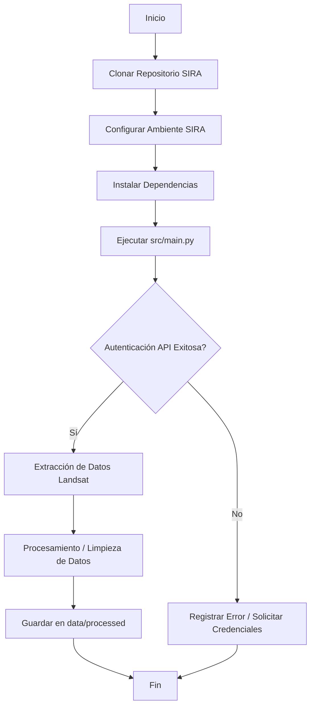

# SIRA

Repositorio principal para la extracción, procesamiento y análisis de datos de Landsat.

## Diagrama de Flujo del Desarrollo del Proyecto



## Guía de Clonación e Instalación

El repositorio se clona en una carpeta llamada `SIRA` y el ambiente se llama `SIRA` en las 3 opciones soportadas.

### 1. Opción Conda (Recomendada para Data Science)
Abre tu terminal de Anaconda/Miniconda y ejecuta:
```bash
git clone https://github.com/GomSal/SIRA.git
cd SIRA
conda create --name SIRA python=3.10 -y
conda activate SIRA
pip install -r requirements.txt
```

### 2. Opción PowerShell (Usuarios Windows)
Abre PowerShell como administrador y ejecuta:
```powershell
git clone https://github.com/GomSal/SIRA.git
cd SIRA
python -m venv SIRA
.\SIRA\Scripts\Activate.ps1
pip install -r requirements.txt
```
*(Nota: Si obtienes un error de políticas de ejecución, ejecuta `Set-ExecutionPolicy -ExecutionPolicy RemoteSigned -Scope CurrentUser` previamente).*

### 3. Opción Pip / Terminal estándar (Linux/macOS)
Abre tu terminal Bash/Zsh y ejecuta:
```bash
git clone https://github.com/GomSal/SIRA.git
cd SIRA
python3 -m venv SIRA
source SIRA/bin/activate
pip install -r requirements.txt
```
